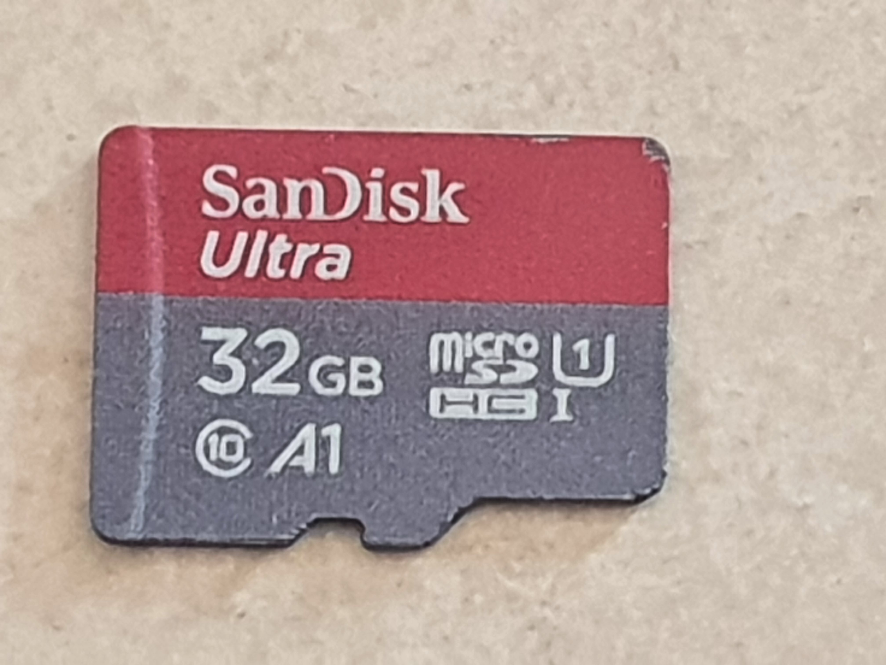

# SDCard

This repository contains a portable OpenSource SDCard controller for FPGAs
written in VHDL.  I'm writing my own implementation because I've looked at
several other implementations, and they all seemed lacking in various regards
(features, stability, portability, simplicity, etc.).

The SDCard controller in this repository is a complete rewrite from scratch,
and is provided with a [MIT license](LICENSE).

This implementation only supports the 4-bit SD mode, i.e. it doesn't support
the 1-bit SD mode, nor does it support the SPI mode. There are plenty of
open-source implementations that support SPI mode. It is aimed at being
fast (high-speed), small, and portable.

## Resources
The [doc](doc) folder contains useful resources, including
* [Part1_Physical_Layer_Simplified_Specification_Ver8.00.pdf](doc/Part1_Physical_Layer_Simplified_Specification_Ver8.00.pdf)
  downloaded from [sdcard.org/downloads/pls](https://www.sdcard.org/downloads/pls).
* [sdcard_mass_storage_controller_latest.tar.gz](doc/sdcard_mass_storage_controller_latest.tar.gz)
  downloaded from [opencores.org/projects/sdcard_mass_storage_controller](https://opencores.org/projects/sdcard_mass_storage_controller).
* [SDFlashControllerUsingSDBus-Documentation.pdf](doc/SDFlashControllerUsingSDBus-Documentation.pdf)
  downloaded from [www.latticesemi.com](https://www.latticesemi.com/-/media/LatticeSemi/Documents/ReferenceDesigns/SZ/SDFlashControllerUsingSDBus-Documentation.ashx?document_id=36706).

The [sim](sim) folder contains the files needed for testing in simulation
* [sdModel.v](sim/sdModel.v). This is an SDCard simulation model copied from
  [opencores.org/projects/sdcard_mass_storage_controller](https://opencores.org/projects/sdcard_mass_storage_controller).

## Testing
The SD Card I'm testing on is a 32 GB SDHC card from SanDisk with a speed class of 10 MB/s.

This card responds to CMD8 and therefore supports V2.X of the SD protocol.
Additionally, it responds with CCS set (= SDHC).

The CID 035344534333324780B90C4E7F0138 is decoded as follows:

| field | value      | interpretation |
| ----- | ---------- | -------------- |
| MID   | 03         | SanDisk        |
| OID   | 5344       | SD             |
| PNM   | 5343333247 | SC32G          |
| PRV   | 80         | 8.0            |
| PSN   | B90C4E7F   | Serial Number  |
| MDT   | 138        | August 2019    |

The CSD 400E00325B590000EDC87F800A4040 is decoded as follows:

| field                  | value | interpretation                 |
| -----                  | ------| --------------                 |
| CSD\_STRUCTURE         |    01 | SDHC                           |
| (TAAC)                 |    0E | 1.0 ms                         |
| (NSAC)                 |    00 | 0 clocks                       |
| (TRAN\_SPEED)          |    32 | 25 Mb/s                        |
| CCC                    |   5B5 | 0, 2, 4, 5, 7, 8, 10           |
| (READ\_BL\_LEN)        |     9 | 512 bytes                      |
| (READ\_BL\_PARTIAL)    |     0 | No                             |
| (WRITE\_BLK\_MISALIGN) |     0 | No                             |
| (READ\_BLK\_MISALIGN)  |     0 | No                             |
| DSR\_IMP               |     0 | DSR not implemented            |
| C\_SIZE                |  EDC8 | 31 GB                          |
| (ERASE\_BLK\_EN)       |     1 | Yes                            |
| (SECTOR\_SIZE)         |    7F | 64 kB                          |
| (WP\_GRP\_SIZE)        |    00 | 1 sector                       |
| (WP\_GRP\_ENABLE)      |     0 | No                             |
| (R2W\_FACTOR)          |     2 | factor 4                       |
| (WRITE\_BL\_LEN)       |     9 | 512 bytes                      |
| (WRITE\_BL\_PARTIAL)   |     0 | No                             |
| (FILE\_FORMAT\_GRP)    |     0 | File format group              |
| COPY                   |     1 | copy flag                      |
| PERM\_WRITE\_PROTECT   |     0 | No                             |
| TMP\_WRITE\_PROTECT    |     0 | No                             |
| (FILE\_FORMAT)         |     0 | Hard disk with partition table |

